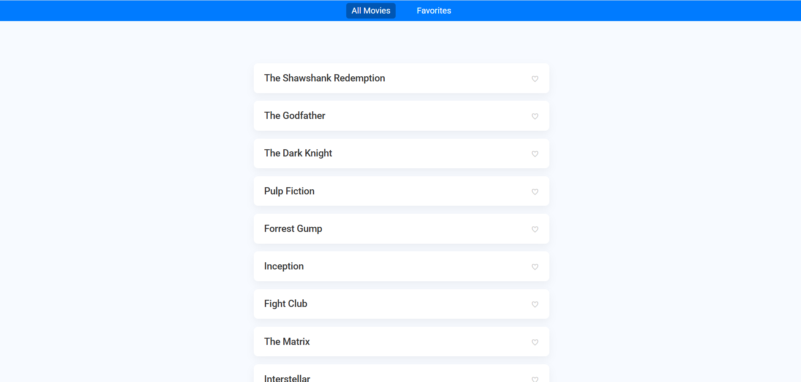

# 🎬 Favorite Movies App

This is a simple and interactive Favorite Movies Web App built using plain JavaScript, HTML, and CSS. Users can browse a predefined list of popular movies, mark their favorites by clicking a heart icon, and view their personalized list of favorite movies.

---

## 🌟 Features

- **Movie List**: Browse through a selection of popular movies.
- **Favorite Movies**: Mark/unmark movies as favorites using a heart icon.
- **Persistent Storage**: Favorites are saved to local storage, so they persist even after refreshing the page.
- **Responsive Navigation**: Easily switch between viewing all movies and your favorites.
- **Modern UI**: Clean, modern design with smooth interactions and hover effects.

---

## 🛠️ Technologies Used

- HTML
- CSS
- JavaScript
- Local Storage

---

## 📂 Project Structure

```
FavoriteMoviesApp/
├── index.html
├── style.css
└── app.js
```

- `index.html`: Contains the structure of the app.
- `style.css`: Contains all styling (modern design and responsive layout).
- `app.js`: JavaScript logic including event handling, rendering movies, and local storage integration.

---

## 🚀 Getting Started

To run the project locally:

1. Clone this repository or download the files.

```bash
git clone https://github.com/Ordnarycoder/Favorite-Movies-App-52.git
```

2. Open the `index.html` file in your browser.

---

## 📌 Usage

- **Mark as Favorite**: Click the heart icon next to a movie.
- **View Favorites**: Click "Favorites" in the navigation bar to view all your favorite movies.
- **All Movies**: Click "All Movies" in the navigation bar to return to the full list.

---

## 📷 Preview



---

## 📄 License

This project is open-source and available under the [MIT License](LICENSE).

---

🎉 **Enjoy managing your favorite movies!**

